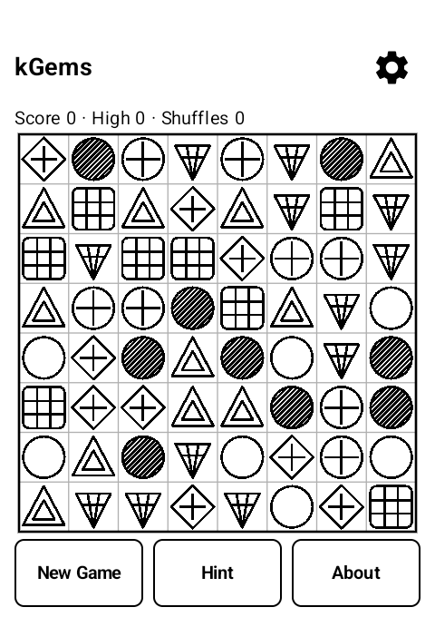
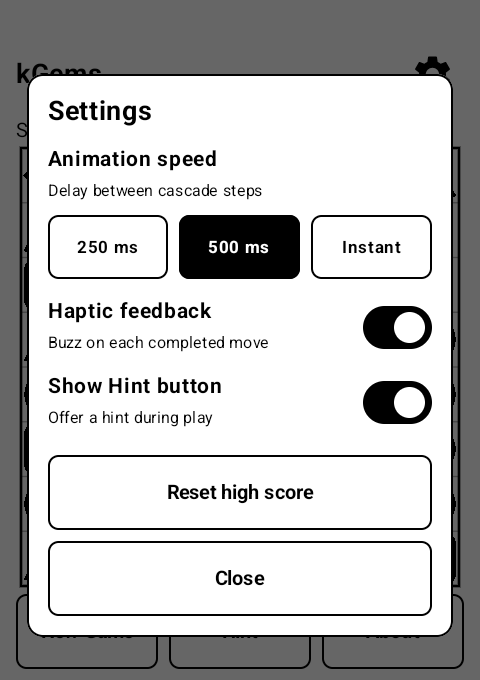
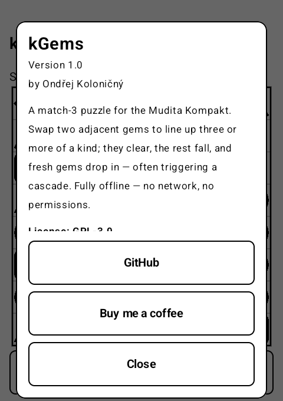

# kGems


**kGems** is a match-3 puzzle for the
[Mudita Kompakt](https://mudita.com/) e-ink phone (MuditaOS-K, AOSP,
**no Google Services**). Swap two adjacent gems to line up three or more of a
kind; they clear, the rest fall, fresh gems drop in from the top, and the chain
keeps scoring as long as new matches form. Fully offline: **no network, no
permissions, no services.**

[](https://www.buymeacoffee.com/ok1cdj)

<p align="center">
  
  &nbsp;
  
  &nbsp;
  
</p>

<p align="center"><em>Running on the Mudita Kompakt (480×800 e-ink).</em></p>

## What it does

- Classic match-3 on an **8×8** board of **7 gem types**. Tap a gem, then tap an
  orthogonally adjacent gem to swap them. A swap is only legal if it forms a run
  of three or more — illegal swaps do nothing.
- Matched runs clear, survivors fall **down**, and the emptied top refills — a
  single move can set off a **cascade** of further matches, each wave worth
  progressively more.
- **Endless:** the game never ends. When a move leaves no legal swap, the board
  is automatically reshuffled (a counter tracks how often) so you are never
  stuck.
- **Hint** highlights a legal swap; **Settings** (gear, top-right) let you pick
  the cascade animation speed (250 ms / 500 ms / instant), toggle **haptic
  feedback** on each move (uses the system haptic channel — no `VIBRATE`
  permission), show or hide the Hint button, and reset the high score.
- **Resumes exactly** where you left off after the app is killed — board, score,
  high score, shuffle/hint counts, and the random-number stream (so all future
  refills are identical) are all restored.
- Built for e-ink: pure 1-bit black/white, vector gem glyphs, tap-to-swap. Each
  of the seven gems is distinguished along three axes at once — silhouette,
  interior pattern and fill density — so no two read alike at a glance. The
  selected gem is shown inverted.
- Localised: **English** (default) and **Czech**, following the system locale.

## Origin

The match-3 mechanic originates with **Shariki**, written by **Eugene Alemzhin**
in **1994**. kGems is an original, independent implementation of that idea for
e-ink — its engine, artwork and code are its own.

## Building

`:core` is pure Kotlin/JVM (the rules engine); `:app` is the Android/Compose UI.

```sh
./gradlew :core:test        # run the engine test suite (no Android SDK needed)
./gradlew :app:assembleDebug # build a debug APK (Android SDK required)
```

For a signed release build, copy `local.properties.example` to
`local.properties`, point it at your SDK and a signing keystore (generated once
with `keytool`, never committed — see `keystore/`), then:

```sh
scripts/build-release.sh    # runs tests, then builds kgems-<version>.apk
```

CI runs the engine tests on every push and PR
([`.github/workflows/test.yml`](.github/workflows/test.yml)); pushing a `v*` tag
builds and publishes a signed release
([`.github/workflows/release.yml`](.github/workflows/release.yml)).

## Privacy

kGems requests **zero Android permissions** and makes **no network connections**.
Everything — including saved progress — stays on the device. You can confirm the
permission set with `aapt dump permissions` on any built APK: it lists only the
package line.

## License

**GPL-3.0-or-later.** See [`LICENSE`](LICENSE).

Copyright © 2026 Ondřej Koloničný, OK1CDJ.
